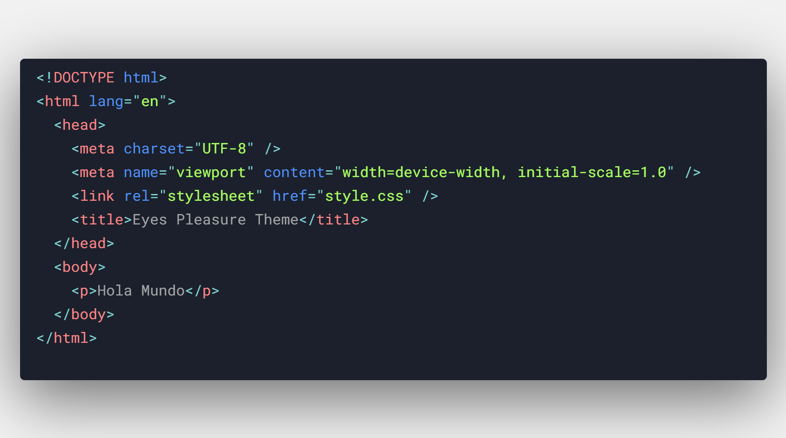

<p align="center">
    
    <br>
    <a style="font-size:larger" href="https://github.com/soyarnaldo/eyes-pleasure-dark-theme">Eyes Pleasure Theme for Visual Studio Code</a>
    <br>
    <span>Supported Languages:</span>
    <i>C, C++, C#, CSS, SCSS, Go, HTML, Java, JS, JSX, JSON, Lua, Perl,<br>PHP, PHTML, Prisma, Python, Ruby, Rust, Shell, SQL, Swift, TypeScript, TSX, YAML</i>
    <br />
    <br />
</p>

## Description

Eyes Pleasure is a modern dark theme, which aims to combine practicality and elegance with simplicity.
Will be maintaining this as I have time, thanks for your understanding!

## Screenshots



## Settings

**Note:** The font used in the screenshots is [Roboto Mono](https://fonts.google.com/specimen/Roboto+Mono).

```json
{
  "editor.fontFamily": "Roboto Mono",
  "editor.fontSize": 15,
  "editor.lineHeight": 30,
  "editor.letterSpacing": -0.75,
  "editor.minimap.enabled": false,
  "workbench.editor.showTabs": "single",
  "window.menuBarVisibility": "compact"
}
```

## License

This theme is licensed under the MIT License.
